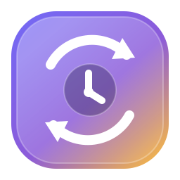
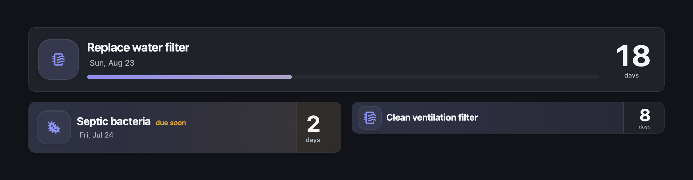
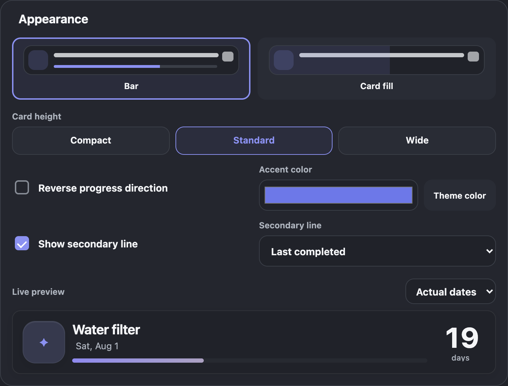

<p align="center">
  
</p>

<h1 align="center">Maintenance Countdown</h1>

<p align="center">
  <strong>Recurring maintenance, always in sight.</strong><br>
  Beautiful Home Assistant countdown cards for filters, cleaning, refills, inspections, and everything that needs doing again.
</p>

<p align="center">
  <a href="https://github.com/PnnnG/Maintenance-Countdown/releases"></a>
  
  
  
  <a href="LICENSE"></a>
</p>

<p align="center">
  <a href="https://my.home-assistant.io/redirect/hacs_repository/?owner=PnnnG&repository=Maintenance-Countdown&category=integration"></a>
</p>



Maintenance Countdown turns recurring household maintenance into clear, glanceable dashboard cards. Set reminders for the warning window and due date, see each task's urgency at a glance, and complete it directly from the card. The next cycle starts from the date you actually completed the task—not from an idealized schedule or the day you happened to open the dashboard.

## Highlights

<table>
  <tbody>
    <tr>
      <td><strong>See what matters now</strong><br>Normal, warning, due, and overdue states are recognizable at a glance.</td>
      <td><strong>Fits your dashboard</strong><br>Choose Bar or Card fill, Compact, Standard, or Wide height, an optional date line, and a custom accent color.</td>
    </tr>
    <tr>
      <td><strong>Configure visually</strong><br>Create and edit maintenance tasks without writing YAML. The live preview follows your changes immediately.</td>
      <td><strong>Works with your theme</strong><br>Light, dark, transparent, glass, flat, and custom themes keep their own character.</td>
    </tr>
    <tr>
      <td><strong>Never miss a cycle</strong><br>Receive a warning before a task expires and a due notification when it needs attention—even with no dashboard open.</td>
      <td><strong>Use it everywhere</strong><br>Every task has a sensor, and the completion action is available to cards, automations, and scripts.</td>
    </tr>
    <tr>
      <td><strong>Behaves like Home Assistant</strong><br>Tap, hold, and double-tap actions are configurable. Dates use the Home Assistant timezone.</td>
      <td><strong>English and Russian</strong><br>The interface follows each user's Home Assistant language and falls back to English.</td>
    </tr>
  </tbody>
</table>

## Installation

### HACS — recommended

1. Add this custom repository to HACS using either method:

   - **Quick install:** select the button below to open the repository in HACS.

     [](https://my.home-assistant.io/redirect/hacs_repository/?owner=PnnnG&repository=Maintenance-Countdown&category=integration)

   - **Manual:** in HACS, open the menu in the top-right corner and select **Custom repositories**. Paste `https://github.com/PnnnG/Maintenance-Countdown`, choose **Integration**, and select **Add**.

2. Open **Maintenance Countdown** in HACS, select **Download**, choose the latest release, and restart Home Assistant when HACS asks you to.
3. Add the integration to Home Assistant:

   [](https://my.home-assistant.io/redirect/config_flow_start/?domain=cyclic_countdown)

   Or go to **Settings → Devices & services → Add integration** and search for **Maintenance Countdown**.

4. Edit a dashboard, select **Add card**, and choose **Maintenance Countdown**.

The card module is registered automatically. You do not need to add a Lovelace resource by hand. If Home Assistant was already open during the first installation, refresh that page once after the restart.

<details>
<summary><strong>Manual installation</strong></summary>

1. Download the latest release.
2. Copy `custom_components/cyclic_countdown` to `<config>/custom_components/cyclic_countdown`.
3. Restart Home Assistant.
4. Add **Maintenance Countdown** from **Settings → Devices & services**.

</details>

## Create your first countdown

1. Edit a dashboard and select **Add card**.
2. Choose **Maintenance Countdown**.
3. Select **New task**.
4. Enter a name, choose an MDI icon, and set the interval, warning window, and last completion date.
5. Adjust the appearance, behavior, and notifications while watching the live preview.
6. Select **Create task**, then save the card.

That is it. The task is stored by the integration, survives restarts, and can be reused on another dashboard without duplicating its dates or notification settings.

## A visual editor, not a YAML form

<p align="center">
  
</p>

The editor keeps task data and card presentation separate:

- **Task** — name, icon, interval, last completion, warning window, and calculated due date.
- **Appearance** — bar or fill style, Compact, Standard, or Wide height, progress direction, accent color, and secondary information.
- **Behavior** — independent tap, hold, and double-tap actions, plus optional confirmation before completion.
- **Notifications** — multiple targets, persistent notifications, warning and due events, message preview, and test delivery using the current unsaved values.

The live preview can simulate every phase without changing the real task.

## Complete, reset, repeat

The default card behavior is deliberately safe:

- **Tap** opens more information.
- **Hold** asks for confirmation and completes the task.
- **Double tap** does nothing.

Each gesture can instead be set to **Complete**, **More info**, or **No action**. When a task is completed, the integration saves today's Home Assistant-local date and begins a fresh cycle. If the request fails, the optimistic card update is rolled back and an error is shown.

## Notifications that do not depend on an open dashboard

Notifications are handled by the backend, so they still work when no browser or Companion app has the dashboard open.

- A warning can be sent once when the task enters its warning window.
- A due notification is sent when the task expires and can be caught up after Home Assistant was offline.
- Multiple targets are attempted independently, and one failing target does not stop the others.
- A persistent Home Assistant notification can be used on its own or alongside device notifications.
- Overdue tasks do not create a new notification every day.

Delivery is best-effort once per event. After at least one destination accepts an event, that cycle is marked as delivered; failed destinations are not retried automatically during the same cycle. If every destination fails, a later reconciliation may try again.

## Home Assistant integration

Every task creates a `sensor.<name>_countdown` entity. Its state is the number of remaining calendar days and its attributes include the task dates, progress, phase, icon, and stable task ID. Private notification contents and targets are not exposed through sensor attributes.

To complete a task from an automation or script:

```yaml
action: cyclic_countdown.complete
data:
  task_id: 2f96074a-8a53-4b35-bb80-d8ce560cf888
```

## Advanced configuration

<details>
<summary><strong>YAML card configuration</strong></summary>

The visual editor is the recommended way to configure a card. The equivalent portable YAML is:

```yaml
type: custom:cyclic-countdown-card
task_id: 2f96074a-8a53-4b35-bb80-d8ce560cf888
style: bar
vertical_size: standard
reverse_progress: false
confirm_complete: true
show_secondary: true
secondary_info: last_completed
tap_action: more-info
hold_action: complete
double_tap_action: none
```

Task dates and notification settings remain in the backend and are not duplicated in the card configuration.

</details>

<details>
<summary><strong>Themes, glass effects, and card-mod</strong></summary>

The card follows standard Home Assistant variables for card background, border, shadow, backdrop filter, text, divider, accent, warning, error, and success colors. Transparent surfaces remain transparent, which allows glass and blur themes to work naturally.

Optional fine-grained variables:

- `--cyclic-countdown-background`
- `--cyclic-countdown-backdrop-filter`
- `--cyclic-countdown-border`
- `--cyclic-countdown-shadow`
- `--cyclic-countdown-icon-background`
- `--cyclic-countdown-icon-border`
- `--cyclic-countdown-icon-shadow`
- `--cyclic-countdown-icon-backdrop-filter`
- `--cyclic-countdown-warning-color`
- `--cyclic-countdown-danger-color`

These can be provided by a theme or card-mod. card-mod is not required.

</details>

<details>
<summary><strong>Language and accessibility</strong></summary>

English is the primary language and universal fallback. Any locale beginning with `ru` uses Russian; other or unknown locales use English. Backend strings use Home Assistant translations, while the card uses a compact built-in dictionary.

Interactive targets are at least 44×44 px. The card supports keyboard actions and visible focus, localized ARIA descriptions, non-color status indicators, and a static fallback for `prefers-reduced-motion`.

Keyboard shortcuts:

- `Enter` — configured tap action
- `Shift+Enter` — configured hold action
- `Alt+Enter` — configured double-tap action

</details>

## Requirements

- Home Assistant Core 2026.7 or newer.
- A browser or Companion app supported by that Home Assistant release.
- HACS for the recommended installation path.

## Troubleshooting

### The icon is missing only in the HACS repository list

The integration already ships its local brand assets in the Home Assistant-recommended `custom_components/cyclic_countdown/brand/` directory. Home Assistant can therefore display the icon in integration setup and settings.

Some current HACS versions do not yet use these local custom-integration brand assets in the HACS repository list. In that specific screen, clearing the browser or Companion cache is not a reliable fix. This is tracked upstream in [hacs/integration#5171](https://github.com/hacs/integration/issues/5171) and does not affect the integration or card.

### The card is not available immediately after installation

Restart Home Assistant after downloading the integration, then refresh clients that were already open. No manual Lovelace resource should be necessary.

Still stuck? [Open a bug report](https://github.com/PnnnG/Maintenance-Countdown/issues/new/choose) and include your Home Assistant version, Maintenance Countdown version, client, and reproduction steps.

## Updating and removing

- Back up Home Assistant, then install the new release through HACS.
- Existing data uses a versioned storage schema and is migrated during startup.
- Deleting a task requires confirmation. Cards that still reference it show **Task not found**.
- For complete removal, delete the cards and tasks, remove the integration first so it can clean up its Lovelace resource, and only then uninstall it from HACS.

<details>
<summary><strong>Development and architecture</strong></summary>

`TaskManager` owns versioned storage and is the single source of truth. Sensor entities receive push updates without per-second polling. Local midnight and timezone changes refresh derived states and notification reconciliation. WebSocket task and notification management requires administrator permission, while completion checks control permission for the corresponding entity.

Frontend checks:

```text
cd frontend
pnpm install
pnpm run typecheck
pnpm run lint
pnpm test
pnpm run build
```

The production bundle is written to `custom_components/cyclic_countdown/frontend/cyclic-countdown-card.js`. CI verifies backend tests and linting, frontend typecheck, lint, tests and bundle provenance, hassfest, HACS validation, and the supported Home Assistant version matrix.

Every tagged release must also pass the real Home Assistant and Companion checks in the [release checklist](docs/development/release-checklist.md). Native icon search and repeated card loading are not considered verified by local component stubs alone.

See [CONTRIBUTING.md](CONTRIBUTING.md) before proposing a code change.

</details>

## Changelog

See [CHANGELOG.md](CHANGELOG.md).

## License

Maintenance Countdown is released under the permissive [MIT License](LICENSE). You may use, modify, and redistribute it as long as the license and copyright notice are retained; the software is provided without warranty.
